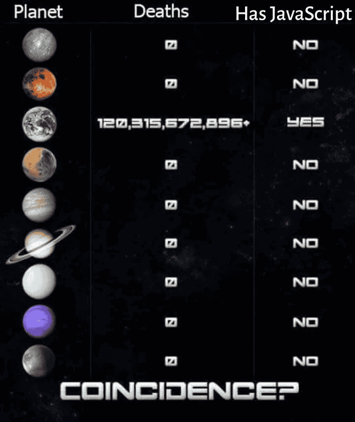

# RATIONALE

- always wanted to play with CF Workers
- of course, WASM is overkill here, but that makes things much more interesting, and proves tooling is good enough (though there's no async support)
- I love Rust and CloudFlare :)
- I pray for the idea of JavaScript-free world. People should stop suffering finally, and sleep well after work.

---

